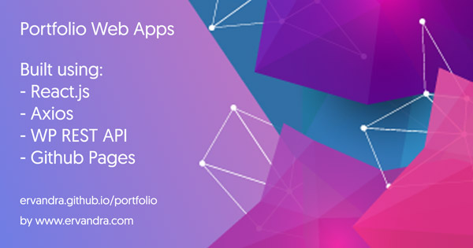

Portfolio Web Apps repository, part of `www.ervandra.com/portfolio`

## <Sinopsis />
Sekarang kamu bisa lihat portfolio saya yang di re-build menggunakan react.js lho, jadi website nya pure web apps, datanya diambil dari WP REST API dari website saya di www.ervandra.com.

## <Asal Usul />
Berawal dari keinginan untuk develop dan develop, ide banyak, namun eksekusi kurang, akhirnya saya putuskan, akan meng-konversi-kan sebagian atau keseluruhan fungsionalitas personal website saya ke dalam pecahan web-apps dan mobile apps.

## <Tujuan />
Sekalian menjadi bahan pembelajaran bagi diri sendiri, dengan harapan juga bisa menjadi inspirasi dan memberi kontribusi bagi yang ingin belajar juga (contact me if you need to learn something)

## <Cakupan Materi />
- node.js, react.js, git, github, gh-pages, axios, wordpress, wp-rest api, redux, graphql, sw precache, react-helmet, react SSR and many more will be covered.

More information is available on www.ervandra.com
